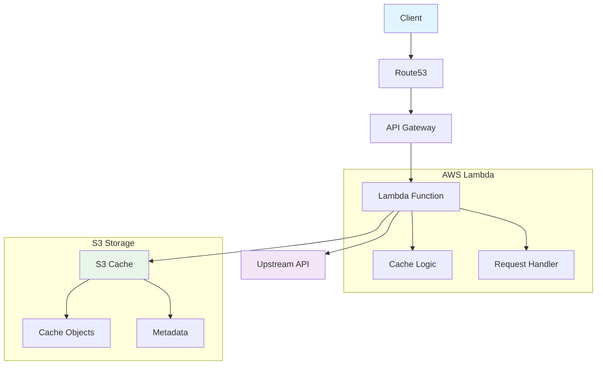

# Development

This section covers development, architecture, and contribution guidelines for Dejafoo.

## Architecture

### High-Level Architecture



### Two-Phase Deployment Strategy

The infrastructure is split into two phases to handle SSL certificate validation:

**Phase 1 (Core Infrastructure):**
- Creates S3 bucket for caching
- Creates Lambda function with IAM roles
- Creates API Gateway (without custom domain)
- Creates Route53 hosted zone and outputs nameservers
- **No SSL certificates** - avoids validation issues

**Phase 2 (DNS & SSL):**
- Creates SSL certificates with DNS validation
- Creates DNS records for custom domain
- Configures API Gateway custom domain
- **Requires**: Nameservers updated at domain registrar

### Directory Structure

```
dejafoo/
├── src/                  # Source code
│   └── index.js         # Lambda function handler
├── package.json          # Node.js dependencies
├── deploy-code.sh        # Lambda code deployment script
├── tests/                # Test files
│   └── test-production.js # Comprehensive production test suite
├── infra/                # Terraform infrastructure
│   ├── phase1.sh        # Phase 1 deployment script
│   ├── phase2.sh        # Phase 2 deployment script
│   ├── phase1/          # Phase 1 Terraform configuration
│   │   ├── core.tf      # Phase 1 main configuration
│   │   ├── terraform.tfvars # Phase 1 variables
│   │   └── modules/     # Phase 1 modules (no SSL)
│   │       ├── apigateway/  # API Gateway without custom domain
│   │       ├── lambda/      # Lambda function setup
│   │       ├── s3/          # S3 bucket for cache
│   │       └── route53/     # Route53 zone only (no SSL)
│   └── phase2/          # Phase 2 Terraform configuration
│       ├── dns.tf       # Phase 2 main configuration
│       ├── dns.tfvars   # Phase 2 variables (auto-generated)
│       └── modules/     # Phase 2 modules (with SSL)
│           ├── apigateway/  # API Gateway with custom domain
│           ├── lambda/      # Lambda function setup
│           ├── s3/          # S3 bucket for cache
│           └── route53/     # Route53 with SSL certificates
└── docs/                 # Documentation
    ├── mkdocs.yml       # MkDocs configuration
    └── ...              # Documentation files
```

## Code Style

### JavaScript

- **ES6+**: Use modern JavaScript features
- **Async/Await**: Prefer async/await over callbacks
- **Error Handling**: Comprehensive error handling
- **Comments**: Inline comments for complex logic

### Terraform

- **HCL2**: Use HCL2 syntax
- **Naming**: Consistent naming conventions
- **Modules**: Modular structure for reusability
- **Variables**: Use variables for configuration

### Testing

- **Comprehensive**: Full test coverage
- **Clear Output**: Pass/fail indicators
- **Production**: Test against production environment
- **Isolation**: Test subdomain isolation

## Development Workflow

### Local Development

1. **Clone Repository**:
   ```bash
   git clone https://github.com/camrail/dejafoo.git
   cd dejafoo
   ```

2. **Install Dependencies**:
   ```bash
   npm install
   ```

3. **Make Changes**:
   ```bash
   vim src/index.js
   ```

4. **Test Locally**:
   ```bash
   node tests/test-production.js
   ```

5. **Deploy Changes**:
   ```bash
   ./deploy-code.sh
   ```

### Testing Strategy

The project uses a comprehensive test suite that covers:

- **Basic Functionality**: HTTP proxy and response handling
- **Subdomain Isolation**: Ensures different subdomains don't leak data
- **Cache Behavior**: Hit/miss patterns with TTL validation
- **Header-based Caching**: Different headers create separate cache entries
- **Method Support**: GET, POST, PUT, DELETE methods
- **Data Leakage Prevention**: Sensitive data isolation between subdomains
- **Error Handling**: Graceful handling of invalid URLs and errors
- **Concurrent Requests**: Multiple simultaneous request handling
- **TTL Functionality**: Cache expiration and refresh behavior
- **S3 Integration**: Large payload handling and cache storage

### Running Tests

```bash
# Run comprehensive test suite
node tests/test-production.js

# Test specific functionality
node -e "
const tests = require('./tests/test-production.js');
tests.runBasicFunctionalityTests();
"
```

## Architecture Details

### Lambda Function

The Lambda function (`src/index.js`) handles:

1. **Request Parsing**: Extract URL, TTL, and other parameters
2. **Cache Key Generation**: Create unique cache keys
3. **Cache Lookup**: Check S3 for existing cached responses
4. **Upstream Request**: Fetch from upstream if cache miss
5. **Cache Storage**: Store response in S3 for future requests
6. **Response Formatting**: Return properly formatted response

### Cache Strategy

- **S3 Storage**: All cache data stored in S3
- **Key Generation**: Based on subdomain, URL, method, headers
- **TTL Management**: Automatic expiration based on TTL parameter
- **Large Files**: Automatic S3 fallback for files >1MB

### Security Model

- **IAM Roles**: Minimal required permissions
- **S3 Encryption**: Server-side encryption for cache storage
- **SSL/TLS**: Automatic SSL certificate management
- **Subdomain Isolation**: Separate cache stores per subdomain

## Contributing

### Getting Started

1. **Fork the Repository**
2. **Create Feature Branch**: `git checkout -b feature/amazing-feature`
3. **Make Changes**: Follow code style guidelines
4. **Test Changes**: Run test suite
5. **Submit Pull Request**: Include description of changes

### Pull Request Process

1. **Update Documentation**: Update relevant documentation
2. **Add Tests**: Add tests for new functionality
3. **Update Tests**: Update existing tests if needed
4. **Test Deployment**: Test deployment process
5. **Submit PR**: Include clear description and testing steps

### Code Review

- **Automated Tests**: All tests must pass
- **Code Style**: Follow established patterns
- **Documentation**: Update relevant documentation
- **Security**: Review security implications
- **Performance**: Consider performance impact

## AWS Resources

### Lambda Function

- **Name**: `dejafoo-proxy-prod`
- **Runtime**: Node.js 18.x
- **Memory**: 256 MB
- **Timeout**: 30 seconds
- **Environment**: Production

### API Gateway

- **Type**: Regional endpoints
- **Custom Domain**: Optional
- **CORS**: Enabled
- **Throttling**: None (self-hosted)

### S3 Bucket

- **Purpose**: Cache storage
- **Encryption**: Server-side encryption
- **Lifecycle**: Automatic cleanup of expired objects
- **Access**: Lambda function only

### Route53

- **Hosted Zone**: For custom domain
- **DNS Records**: A, CNAME records
- **SSL Certificate**: ACM certificate with DNS validation

## Environment Variables

| Variable | Description | Default |
|----------|-------------|---------|
| `S3_BUCKET_NAME` | S3 bucket for cache storage | Required |
| `UPSTREAM_BASE_URL` | Default upstream service URL | Optional |
| `CACHE_TTL_SECONDS` | Default cache TTL in seconds | 3600 |
| `NODE_ENV` | Node environment | production |

## Performance Considerations

### Lambda Performance

- **Cold Start**: ~200-500ms
- **Warm Request**: ~50-100ms
- **Cache Hit**: ~20-50ms
- **Throughput**: 1000+ requests/second

### S3 Performance

- **Read Latency**: ~10-50ms
- **Write Latency**: ~50-100ms
- **Throughput**: High (S3 scales automatically)

### API Gateway Performance

- **Regional Endpoints**: Lower latency than edge
- **No CloudFront**: Simplified caching
- **Direct Lambda**: No additional latency

## Monitoring and Debugging

### CloudWatch Logs

```bash
# View Lambda logs
aws logs describe-log-groups --log-group-name-prefix "/aws/lambda/dejafoo"

# Get recent log events
aws logs get-log-events --log-group-name "/aws/lambda/dejafoo-proxy-prod" --log-stream-name "latest"
```

### Debug Commands

```bash
# Test API Gateway directly
curl -v "https://your-api-id.execute-api.region.amazonaws.com/prod?url=https://jsonplaceholder.typicode.com/todos/1&ttl=30s"

# Check Lambda function
aws lambda invoke --function-name dejafoo-proxy-prod response.json

# Test local development
node tests/test-production.js
```

## Common Issues

### SSL Certificate Validation

- **Problem**: Certificate validation fails
- **Solution**: Ensure nameservers are updated before Phase 2
- **Check**: `nslookup -type=NS yourdomain.com`

### Cache Key Consistency

- **Expected**: Same request parameters = same cache key
- **TTL behavior**: Cache expires, but key remains consistent
- **Test**: Verify MISS → HIT → MISS pattern

### Large File Handling

- **S3 fallback**: Files >1MB automatically use S3
- **Cache headers**: Check `x-cache` header for HIT/MISS status
- **Size validation**: Slight size differences in test responses are normal
