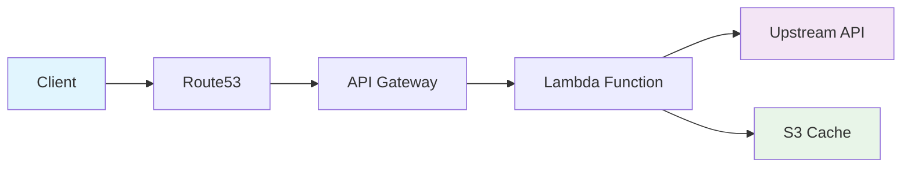

# Dejafoo Documentation

<div class="grid cards" markdown>

-   :material-rocket-launch:{ .lg .middle } **Quick Start**

    ---

    Get up and running with Dejafoo in minutes

    [:octicons-arrow-right-24: Quick Start](getting-started/quick-start.md)

-   :material-cog:{ .lg .middle } **Configuration**

    ---

    Learn how to configure caching, domains, and more

    [:octicons-arrow-right-24: Configuration](getting-started/configuration.md)

-   :material-api:{ .lg .middle } **API Reference**

    ---

    Complete API documentation and examples

    [:octicons-arrow-right-24: API Reference](api-reference/index.md)

-   :material-cloud-upload:{ .lg .middle } **Deployment**

    ---

    Deploy to AWS with our two-phase strategy

    [:octicons-arrow-right-24: Deployment Guide](deployment/index.md)

</div>

## What is Dejafoo?

Dejafoo is a high-performance HTTP proxy service built with AWS Lambda that provides intelligent S3-based caching for expensive API endpoints. It's designed to share cached responses between different environments and applications.

### Key Features

- **🚀 High Performance**: Sub-second response times with intelligent caching
- **☁️ Serverless**: Built on AWS Lambda for automatic scaling
- **🔒 Secure**: SSL/TLS encryption and minimal IAM permissions
- **🌐 Custom Domains**: Full Route53 and API Gateway integration
- **📊 Monitoring**: CloudWatch integration for observability
- **⚡ Easy Deployment**: One-command infrastructure and code deployment

### Architecture



### Quick Example

```bash
# Cache an API response for 1 hour
curl "https://myapp123.dejafoo.io?url=https://jsonplaceholder.typicode.com/todos/1&ttl=1h"

# Use different subdomain for isolation
curl "https://another456.dejafoo.io?url=https://api.example.com/data&ttl=30m"
```

## Getting Started

1. **[Quick Start](getting-started/quick-start.md)** - Get Dejafoo running in 5 minutes
2. **[Installation](getting-started/installation.md)** - Detailed installation guide
3. **[Configuration](getting-started/configuration.md)** - Configure caching and domains
4. **[Usage](user-guide/usage.md)** - Learn how to use Dejafoo effectively

## Documentation Structure

This documentation is organized into several sections:

- **Getting Started**: Installation and basic setup
- **User Guide**: How to use Dejafoo effectively
- **API Reference**: Complete API documentation
- **Deployment**: Infrastructure and code deployment
- **Development**: Architecture and contribution guide
- **Reference**: Technical reference materials

## Support

- **GitHub Issues**: [Report bugs or request features](https://github.com/camrail/dejafoo/issues)
- **Documentation**: This site contains comprehensive guides
- **Community**: Join our discussions on GitHub

---

**Built with ❤️ using AWS Lambda, API Gateway, and S3**
