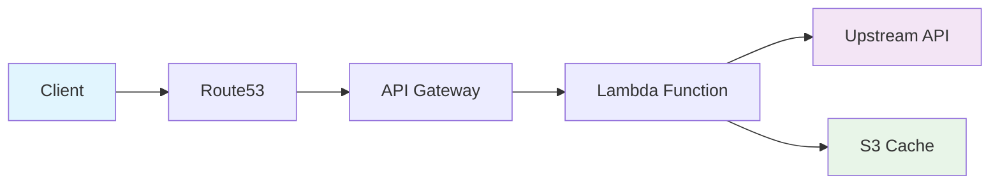

# Dejafoo Documentation

<div class="grid cards" markdown>

-   :material-rocket-launch:{ .lg .middle } **Quick Start**

    ---

    Get up and running with Dejafoo in minutes

    [:octicons-arrow-right-24: Quick Start](getting-started/quick-start.md)

-   :material-cog:{ .lg .middle } **Configuration**

    ---

    Learn how to configure caching, domains, and more

    [:octicons-arrow-right-24: Configuration](getting-started/configuration.md)

-   :material-api:{ .lg .middle } **API Reference**

    ---

    Complete API documentation and examples

    [:octicons-arrow-right-24: API Reference](api-reference/index.md)

-   :material-cloud-upload:{ .lg .middle } **Deployment**

    ---

    Deploy to AWS with our two-phase strategy

    [:octicons-arrow-right-24: Deployment Guide](deployment/index.md)

</div>

## What is Dejafoo?

Dejafoo is a high-performance HTTP proxy service built with AWS Lambda that provides intelligent S3-based caching for expensive API endpoints. It's designed to share cached responses between different environments and applications.

## Why Dejafoo Exists

### The Problem: Expensive API Credits Burn Too Fast

When building features that depend on expensive APIs (like Apollo, Coresignal, or other services with limited monthly requests), you quickly burn through your credits during development. Running the same API calls in development, staging, and production means **paying 3x for the same data**.

### The Solution: Share API Data Across Environments

Dejafoo lets you cache expensive API responses and share them between environments using simple subdomain-based isolation. One API call in development can serve data to production, staging, and other environments without additional API costs.

### Real-World Use Cases

- **Cost Optimization**: Share expensive API data between dev/staging/prod environments
- **Rate Limit Management**: Avoid hitting API rate limits during development and testing
- **Performance**: Get instant responses for repeated API calls
- **Reliability**: Continue development when upstream APIs are down or slow
- **Team Collaboration**: Share expensive API data between team members
- **CI/CD Optimization**: Cache API responses in build pipelines
- **Testing Consistency**: Use the same data across different test runs
- **Cross-Environment Sync**: Keep data consistent across all your environments

### Example: Apollo API Integration

```python
import requests

# Development: Search for companies (uses 1 API credit)
response = requests.post(
    "https://shared123.dejafoo.io?url=https://api.apollo.io/v1/mixed_companies/search&ttl=24h",
    headers={"Content-Type": "application/json"},
    json={"q_organization_domains": "apollo.io", "page": 1}
)

# Staging: Same search, same subdomain = cache hit, no additional API cost
response = requests.post(
    "https://shared123.dejafoo.io?url=https://api.apollo.io/v1/mixed_companies/search&ttl=24h",
    headers={"Content-Type": "application/json"},
    json={"q_organization_domains": "apollo.io", "page": 1}
)

# Production: Same search, same subdomain = cache hit, no additional API cost
response = requests.post(
    "https://shared123.dejafoo.io?url=https://api.apollo.io/v1/mixed_companies/search&ttl=24h",
    headers={"Content-Type": "application/json"},
    json={"q_organization_domains": "apollo.io", "page": 1}
)
```

**Result**: 1 API call, 3 environments served. Save 66% on API costs!

**Note**: All environments use the same subdomain (`shared123`) to share cached data. Different subdomains create separate cache stores for isolation when needed.

### Key Features

- **High Performance**: Sub-second response times with intelligent caching
- **Serverless**: Built on AWS Lambda for automatic scaling
- **Secure**: SSL/TLS encryption and minimal IAM permissions
- **Custom Domains**: Full Route53 and API Gateway integration
- **Monitoring**: CloudWatch integration for observability
- **Easy Deployment**: One-command infrastructure and code deployment

### Architecture



### Quick Example

```bash
# Cache a POST request for 1 hour
curl -X POST "https://myapp123.dejafoo.io?url=https://api.example.com/users&ttl=1h" \
  -H "Content-Type: application/json" \
  -d '{"name": "John Doe", "email": "john@example.com"}'

# Use different subdomain for isolation
curl -X POST "https://another456.dejafoo.io?url=https://api.example.com/orders&ttl=30m" \
  -H "Content-Type: application/json" \
  -d '{"product_id": 123, "quantity": 2}'
```

## Getting Started

1. **[Quick Start](getting-started/quick-start.md)** - Get Dejafoo running in 5 minutes
2. **[Installation](getting-started/installation.md)** - Detailed installation guide
3. **[Configuration](getting-started/configuration.md)** - Configure caching and domains
4. **[Usage](user-guide/usage.md)** - Learn how to use Dejafoo effectively

## Documentation Structure

This documentation is organized into several sections:

- **Getting Started**: Installation and basic setup
- **User Guide**: How to use Dejafoo effectively
- **API Reference**: Complete API documentation
- **Deployment**: Infrastructure and code deployment
- **Development**: Architecture and contribution guide
- **Reference**: Technical reference materials

## Support

- **GitHub Issues**: [Report bugs or request features](https://github.com/camrail/dejafoo/issues)
- **Documentation**: This site contains comprehensive guides
- **Community**: Join our discussions on GitHub

---

**Built with AWS Lambda, API Gateway, and S3**
